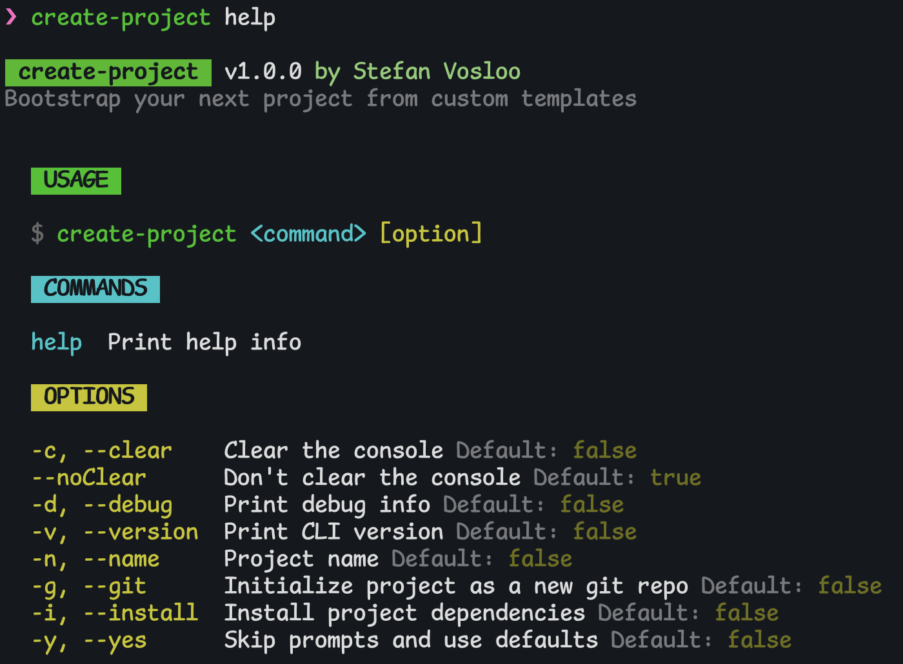
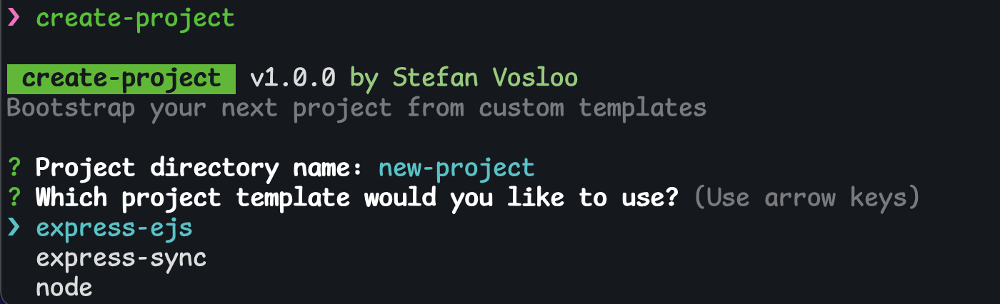
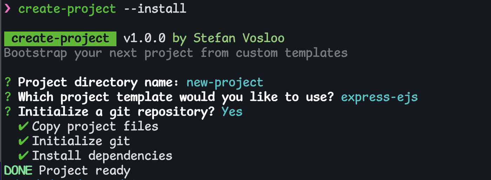

# **Create Project**: Bootstrap your next project from a template

All sub-directories in the `templates` directory will be valid template options.
Each template should have a `package.json`. All files and directories in a
template will be copied to the new project directory, and dependencies can
optionally be installed automatically with the `--install` flag.

## Screenshots





## Usage

Clone this repo, `cd` into the directory, and run `npm link` to have access to the `create-project` command globally.

Execute `create-project` or follow the prompts to set your new project's
directory name, the template you want to use, and whether you want to initialize
it as a git repository.

A new directory using the project's name will be created in the directory where
the command is executed.

Or set these options with the following flags:

- --name, -n: Directory name
- --git, -g: Initialize as a git repo
- --install, -i: Automatically install dependencies (using npm or yarn)
- --yes, -y: Skip prompts and use defaults

```bash
create-project <template> [flags]
```

## Resources referenced

- [How to build a CLI with Node.js - Twilio](https://www.twilio.com/blog/how-to-build-a-cli-with-node-js)
- [npm create-node-cli package - Ahmad Awais](https://www.npmjs.com/package/create-node-cli)
- [Easy Way to Create CLI Scripts with JavaScript and Node - James Q Quick](https://youtu.be/dfTpFFZwazI)
